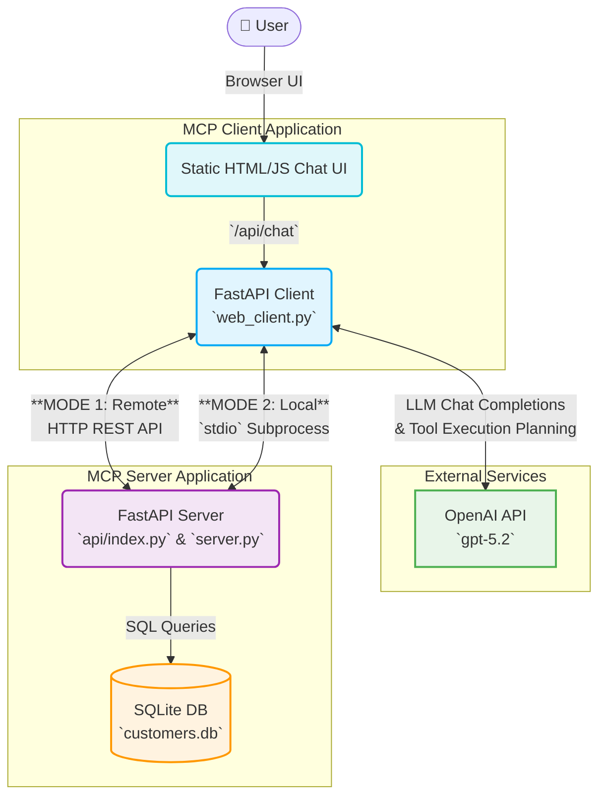

# Project Architecture Diagram

This diagram visualizes the overall architecture of the MCP Customer Support Demo, covering both Local (`stdio`) and Remote (Vercel REST API) deployment modes.

## Architecture Flow

## Component Breakdown

### 1. User Interface (ChatApp)
- The frontend is a static HTML/JS application served by FastAPI.
- Provides a conversational chat interface for customer support queries.
- Communicates with the client backend via the `/api/chat` REST endpoint to submit prompts and retrieve AI responses.

### 2. MCP Client (`mcp-client`)
- Built with **FastAPI**.
- Manages conversational state and integrates directly with the **OpenAI API** (`gpt-5.2`).
- Upon starting or during the first request, it retrieves a list of available tools (e.g., `get_customer_details`, `get_recent_orders`) from the MCP Server and dynamically registers them as function calls in OpenAI.
- **Dual Communication Methods**:
    - **Remote Mode (Vercel)**: When the `MCP_SERVER_URL` is set, it performs REST API calls to the server endpoints (`/tools` and `/call_tool`).
    - **Local Mode**: Uses the official `mcp` SDK to spawn the MCP Server as a local Python subprocess using the `stdio` transport.

### 3. MCP Server (`mcp-server`)
- Built with **FastAPI**, wrapping internal business tasks (fetching customers/orders).
- Designed for serverless environments (like Vercel).
- Exposes two core REST endpoints:
    - `/tools`: Mimics MCP tool discovery functionality by returning a JSON listing of all defined tools and their input schemas.
    - `/call_tool`: Executes an MCP tool by name and returns the functional output.
- Interacts with a simple **SQLite database** (`customers.db`) using Python's DB connections to execute business logic.

### 4. External Logic Engine (OpenAI)
- Acts as the reasoning layer, interpreting `user` messages from the frontend.
- When an action needs to be taken (e.g., retrieving an order status), OpenAI returns a `tool_call` response. The MCP Client parses this, executes the tool against the robust MCP Server, and sends the raw result back to the LLM to form a final user-friendly response.
