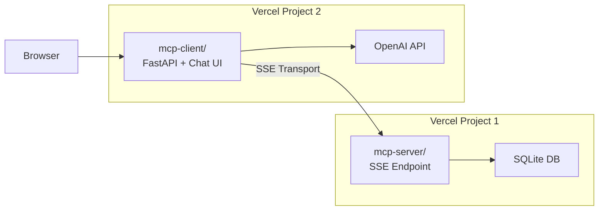

# Walkthrough: Separate Vercel Deployment

## What Was Done

Created two independent Vercel-ready projects inside the existing `mcp_example/` directory:



## Key Change: stdio → SSE Transport

The original client spawned the server as a subprocess via stdio. The refactored client connects to a **remote** MCP server over SSE:

```diff
-from mcp import ClientSession, StdioServerParameters
-from mcp.client.stdio import stdio_client
+from mcp import ClientSession
+from mcp.client.sse import sse_client

-    server_params = StdioServerParameters(
-        command=sys.executable,
-        args=["server.py"],
-        env=None
-    )
-    async with stdio_client(server_params) as (read, write):
+    mcp_server_url = os.environ.get("MCP_SERVER_URL")
+    async with sse_client(mcp_server_url) as (read, write):
```

## Files Created

### `mcp-server/` (9 files)
| File | Purpose |
|------|---------|
| [server.py](file:///c:/Users/maury/Desktop/mcp_example/mcp-server/server.py) | MCP tools (adjusted DB path for serverless) |
| [api/index.py](file:///c:/Users/maury/Desktop/mcp_example/mcp-server/api/index.py) | Vercel entrypoint → `mcp.sse_app()` |
| [vercel.json](file:///c:/Users/maury/Desktop/mcp_example/mcp-server/vercel.json) | Routes all requests to entrypoint |
| [requirements.txt](file:///c:/Users/maury/Desktop/mcp_example/mcp-server/requirements.txt) | `mcp`, `fastmcp`, `python-dotenv` |
| [create_db.py](file:///c:/Users/maury/Desktop/mcp_example/mcp-server/create_db.py) | 8 customers, 15 orders |
| [customers.db](file:///c:/Users/maury/Desktop/mcp_example/mcp-server/customers.db) | Pre-generated SQLite DB |
| [README.md](file:///c:/Users/maury/Desktop/mcp_example/mcp-server/README.md) | Deployment instructions |
| [.env.example](file:///c:/Users/maury/Desktop/mcp_example/mcp-server/.env.example) | Feature flags |
| [.gitignore](file:///c:/Users/maury/Desktop/mcp_example/mcp-server/.gitignore) | Standard ignores |

### `mcp-client/` (8 files)
| File | Purpose |
|------|---------|
| [web_client.py](file:///c:/Users/maury/Desktop/mcp_example/mcp-client/web_client.py) | FastAPI + SSE MCP client (refactored) |
| [api/index.py](file:///c:/Users/maury/Desktop/mcp_example/mcp-client/api/index.py) | Vercel entrypoint → FastAPI `app` |
| [vercel.json](file:///c:/Users/maury/Desktop/mcp_example/mcp-client/vercel.json) | Routes static + API |
| [requirements.txt](file:///c:/Users/maury/Desktop/mcp_example/mcp-client/requirements.txt) | `fastapi`, `openai`, `mcp`, etc. |
| [static/index.html](file:///c:/Users/maury/Desktop/mcp_example/mcp-client/static/index.html) | Chat UI (unchanged) |
| [README.md](file:///c:/Users/maury/Desktop/mcp_example/mcp-client/README.md) | Deployment instructions |
| [.env.example](file:///c:/Users/maury/Desktop/mcp_example/mcp-client/.env.example) | Server URL + OpenAI keys |
| [.gitignore](file:///c:/Users/maury/Desktop/mcp_example/mcp-client/.gitignore) | Standard ignores |

## Deployment Steps

### Step 1: Deploy MCP Server
```bash
cd mcp-server
python create_db.py        # Generate database (if not already done)
vercel                      # Link project
vercel --prod               # Deploy
# Note the URL → e.g. https://mcp-server-xxx.vercel.app
```

### Step 2: Deploy MCP Client
```bash
cd mcp-client
vercel                      # Link project
# Set env vars in Vercel Dashboard:
#   MCP_SERVER_URL = https://mcp-server-xxx.vercel.app/sse
#   OPENAI_API_KEY = sk-...
#   OPENAI_BASE_URL = https://api.openai.com/v1
vercel --prod               # Deploy
```

### Step 3: Test
Open the client URL and ask: *"Can you look up recent orders for alice@example.com?"*

> [!IMPORTANT]
> The original project files ([server.py](file:///c:/Users/maury/Desktop/mcp_example/server.py), [web_client.py](file:///c:/Users/maury/Desktop/mcp_example/web_client.py), etc.) are **untouched** — you can still run the project locally the same way as before.
